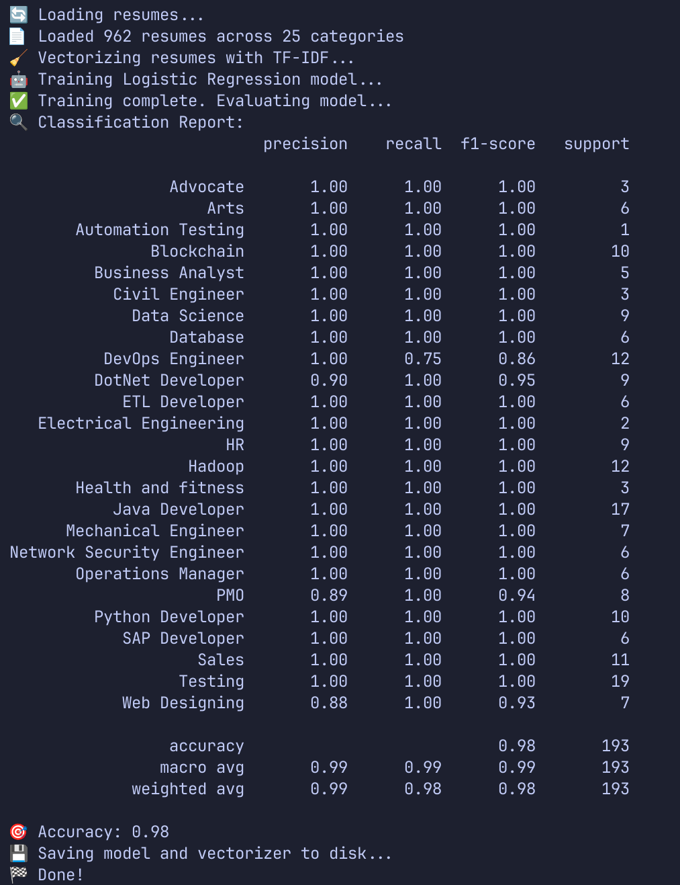

# Resume-Analyser

A Machine Learning powered resume analyzer that runs locally.

This project was inspired by [SpicychieF05's AI Powered Resume Screening System](https://github.com/SpicychieF05/Ai-Resume-Screening-System).

The data is from [here](https://www.kaggle.com/datasets/gauravduttakiit/resume-dataset?select=UpdatedResumeDataSet.csv)

Install requirements with `pip install -r requirements.txt`. Then, do `pip install numpy==1.26.0 --force-reinstall` for compatibility.  

## Converting csv data to text data

To convert the csv data to text data, run the following:  
`python src/convert_dataset.py --csv data/raw/UpdatedResumeDataSet.csv --outdir data/processed/converted`

## train_classifier.py

Initial training with Logistic Regression. Run with `python src/train_classifier.py`.  
Example output:  

## advice.py

This is an MVP version of the Resume-Analyser (more like pre-beta). The test was done on a data science resume, and the criterea was the following:

1. **Length**: Is the resume too short?
2. **Missing keywords**: Are key terms like "Python", "machine learning", etc., missing?
3. **Missing sections**: Are "Experience", "Projects", "Education", or "Skills" missing?
4. **Soft skills**: Check for mentions of soft skills (e.g., communication, leadership).
5. **Role match**: Check how close the resume is to a target career path (e.g., Data Science).
